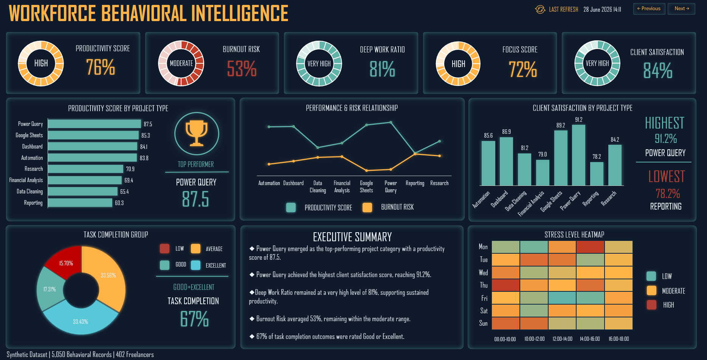
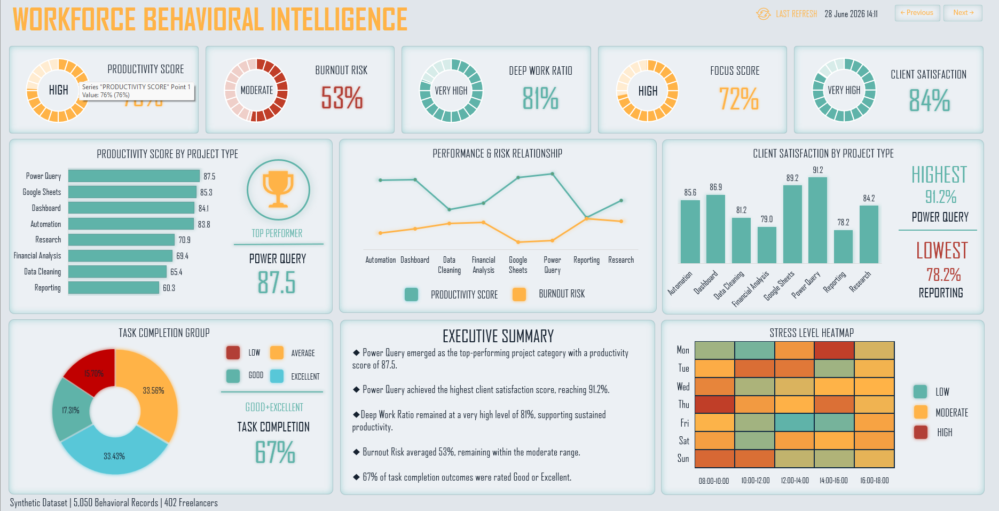
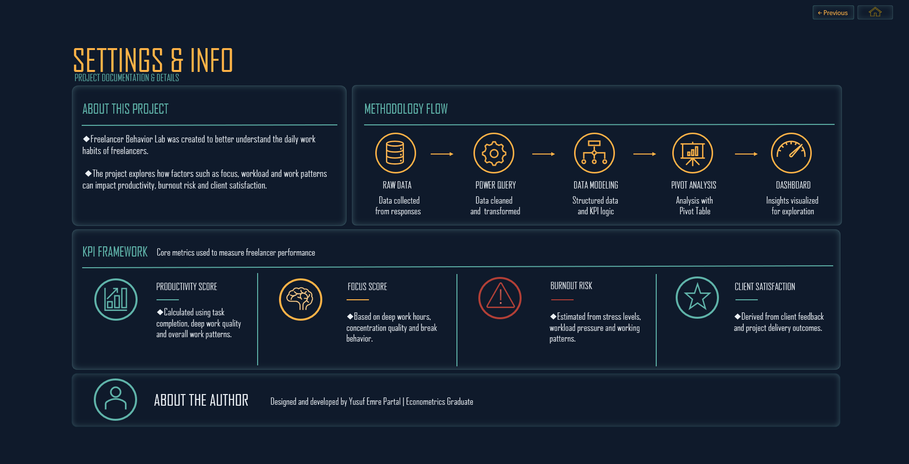

# Freelancer Behavior Lab — Interactive Excel Dashboard

## About the Project

Freelancer Behavior Lab is an interactive Excel dashboard built to analyze freelancer productivity, burnout risk, deep work habits, focus levels, and client satisfaction.

The project was developed using Microsoft Excel, Power Query, and VBA to transform raw data into an interactive dashboard with automation, theme switching, navigation, and data visualization.

---

## Features

* Light & Dark Theme
* Dynamic Theme Engine
* Interactive Navigation
* Auto Refresh
* Last Refresh Timestamp
* Single-Page Dashboard
* KPI Cards
* Power Query Data Processing
* VBA Automation

---

## Dashboard Overview

The dashboard combines KPI cards, charts, heatmaps, and summary panels to present freelancer performance in a clear and easy-to-read format. The interface is designed to remain clean and consistent in both light and dark themes.

---

## Tech Stack

* Microsoft Excel
* Power Query
* VBA

---

## Methodology

The dashboard is built using work activity data, productivity scores, burnout indicators, deep work sessions, and client satisfaction metrics. Power Query is used for data preparation, while VBA powers the automation and interactive user experience.

---

## Screenshots

### Dark Theme

### Light Theme

### Settings

---

## 📌 Display Resolution

This dashboard was designed and optimized for a **1920 × 1080 (16:9)** display.

When viewed on lower screen resolutions (especially **1366 × 768**), some dashboard elements may appear compressed or slightly misaligned due to Excel's rendering behavior.

For the best viewing experience, a display resolution of **1920 × 1080** or higher is recommended.

---

## Download

Choose the version that best fits your needs:

* **[Freelancer_Behavior_Lab_v1.0.xlsx](dashboard/Freelancer_Behavior_Lab_v1.0.xlsx)** — Standard version for exploring the dashboard structure, formulas, and overall design.

* **[Freelancer_Behavior_Lab_Pro_v1.0.xlsm](dashboard/Freelancer_Behavior_Lab_Pro_v1.0.xlsm)** — Full interactive version with VBA automation, navigation, theme switching, and refresh functionality.

---

## Using the Pro Version

Windows may block macros in the **.xlsm** workbook because it was downloaded from the internet.

To enable all features:

1. Right-click the workbook.
2. Select **Properties**.
3. Check **Unblock**.
4. Click **Apply**.
5. Reopen the workbook and enable macros.

---

## License

This project is licensed under the MIT License.

---

## Author

**Yusuf Emre Partal**

Data Analyst with a focus on Excel, Power Query, VBA, and dashboard development.

I enjoy building practical analytical tools that make data easier to understand and work with.
